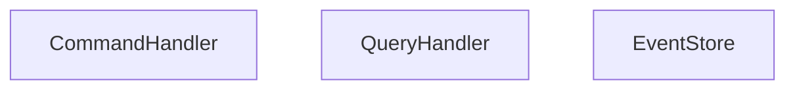

# CQRSProject

## Overview

This project demonstrates CQRS, a pattern that separates read and write operations into different models. It is often used with Event Sourcing to provide a clear audit trail of changes.

## Project Structure

The project follows the CQRS pattern with separate components for command and query handling.

### Components

- **CommandHandler**: Handles command operations for write model.
- **QueryHandler**: Handles query operations for read model.
- **EventStore**: Stores events for event sourcing.

## Diagram

