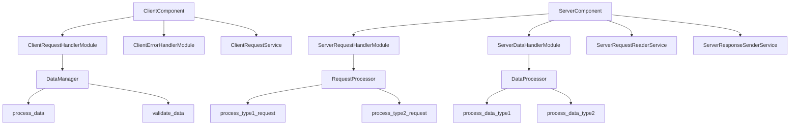

# ClientServerProject

## Overview

ClientServerProject is a sample project demonstrating the Client-Server pattern. The project includes client and server components that interact via API calls.

## Project Structure

The project follows the Client-Server pattern with clearly defined components for client and server functionalities. Refer to the attached JSON file for a detailed description of each component and their relationships.

### Components

- **ClientComponent**: Main component handling client-side functionalities.
- **ServerComponent**: API provider component.

### Services

- **ClientRequestService**: A background service that periodically sends requests to ServerComponent using API provided by ServerRequestHandlerModule.
- **ServerRequestReaderService**: Request reader service that listens for requests from ClientComponent, identifies request type, dispatches the request to one of the modules based on request type, and sends back response using ServerResponseSenderService.
- **ServerResponseSenderService**: Response sender service that sends responses to ClientComponent with data in specific format.

### Modules

- **ClientRequestHandlerModule**: Module handling API requests for ClientComponent. Contains DataManager for managing data operations.
- **ClientErrorHandlerModule**: This module is responsible for handling errors or timeouts of asynchronous operations started by ClientRequestHandlerModule. Registers for ErrorEvent.
- **ServerRequestHandlerModule**: Processes requests of specific type based on the attached data.
- **ServerDataHandlerModule**: Processes data requests of specific type based on the attached data.

### Classes and Methods

- **DataManager**: Class for managing data operations within ClientRequestHandlerModule.
  - **process_data**: A public method that performs a specific data operation using helper method validate_data.
  - **validate_data**: A private helper method encapsulating data validation logic.
- **RequestProcessor**: Class for handling request processing in ServerRequestHandlerModule.
  - **process_type1_request**: Processes requests of type 1.
  - **process_type2_request**: Processes requests of type 2.
- **DataProcessor**: Class for handling data processing in ServerDataHandlerModule.
  - **process_data_type1**: Processes data of type 1.
  - **process_data_type2**: Processes data of type 2.

## Diagram

