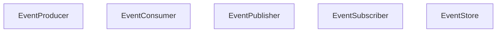

# EventDrivenArchitectureProject

## Overview

This project demonstrates Event-Driven Architecture, where the application is designed around the production, detection, and reaction to events. Components communicate through events, enabling asynchronous and decoupled communication.

## Project Structure

The project follows the Event-Driven Architecture with clearly defined components for event production, consumption, and storage.

### Components

- **EventProducer**: Produces events for various actions.
- **EventConsumer**: Consumes events and performs actions.
- **EventPublisher**: Publishes events to subscribers.
- **EventSubscriber**: Subscribes to events and processes them.
- **EventStore**: Stores events for event sourcing.

## Diagram

