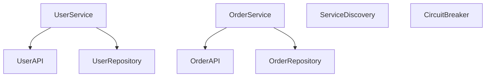

# MicroservicesArchitectureProject

## Overview

This project demonstrates the Microservices Architecture, where the application is divided into multiple small, loosely coupled, and independently deployable services. Each microservice has its own business logic and database.

## Project Structure

The project follows the Microservices Architecture with clearly defined microservices, each handling specific business logic.

### Components

- **UserService**: Handles user-related operations.
- **OrderService**: Handles order-related operations.
- **ServiceDiscovery**: Service discovery component for registering and discovering microservices.
- **CircuitBreaker**: Circuit breaker component to handle fault tolerance in microservices.

### Services

- **UserAPI**: API gateway for user-related operations.
- **OrderAPI**: API gateway for order-related operations.

### Modules

- **UserRepository**: Handles user data operations.
- **OrderRepository**: Handles order data operations.

## Diagram

