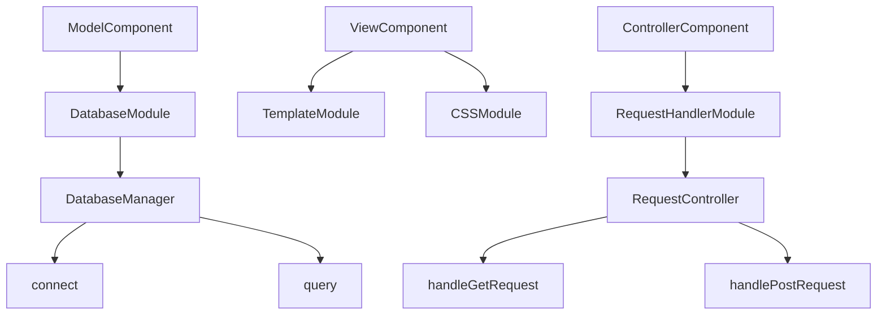

# MyMVCProject

## Overview

MyMVCProject is a sample project demonstrating the Model-View-Controller (MVC) pattern. The project separates concerns into three interconnected components: Model, View, and Controller, facilitating modularity and ease of maintenance.

## Project Structure

The project follows the MVC pattern with clearly defined components for Model, View, and Controller. Refer to the attached JSON file for a detailed description of each component and their relationships.

### Components

- **ModelComponent**: Handles data and business logic.
- **ViewComponent**: Handles user interface and presentation logic.
- **ControllerComponent**: Handles input and updates the model and view.

### Modules

- **DatabaseModule**: Interacts with the database to perform CRUD operations.
- **TemplateModule**: Renders HTML templates.
- **CSSModule**: Contains styles for the application.
- **RequestHandlerModule**: Handles HTTP requests and routes them to the appropriate controller methods.

### Classes and Methods

- **DatabaseManager**: Manages database connections and queries.
  - **connect**: Connects to the database.
  - **query**: Executes a database query.
- **RequestController**: Controller for managing requests.
  - **handleGetRequest**: Handles GET requests.
  - **handlePostRequest**: Handles POST requests.

## Diagram

