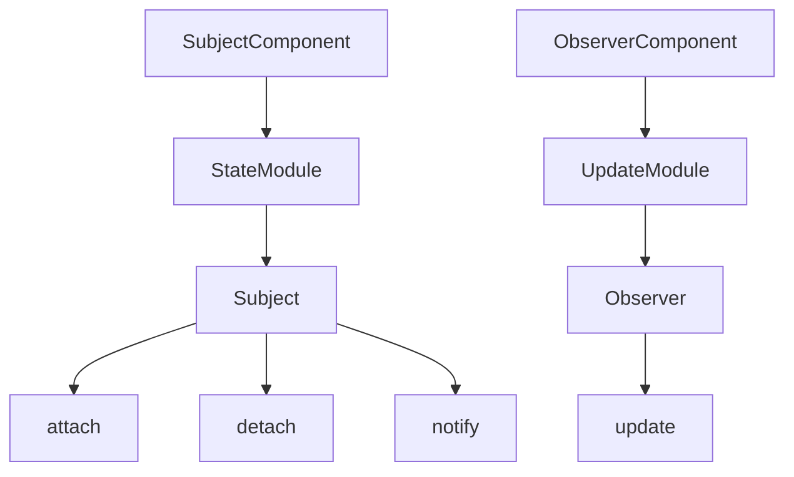

# MyObserverProject

## Overview

MyObserverProject is a sample project demonstrating the Observer pattern. The project includes subjects that notify observers about changes in their state. This pattern is useful for implementing distributed event handling systems.

## Project Structure

The project follows the Observer pattern with clearly defined components for subjects and observers. Refer to the attached JSON file for a detailed description of each component and their relationships.

### Components

- **SubjectComponent**: Defines the subject that maintains a list of observers.
- **ObserverComponent**: Defines observers that receive updates from subjects.

### Modules

- **StateModule**: Handles the state of the subject and notifies observers of changes.
- **UpdateModule**: Receives updates from subjects.

### Classes and Methods

- **Subject**: Maintains a list of observers and notifies them of any state changes.
  - **attach**: Attaches an observer to the subject.
  - **detach**: Detaches an observer from the subject.
  - **notify**: Notifies all observers about a state change.
- **Observer**: Defines the interface for objects that should be notified of changes in a subject.
  - **update**: Gets called when the subject's state changes.

## Diagram

