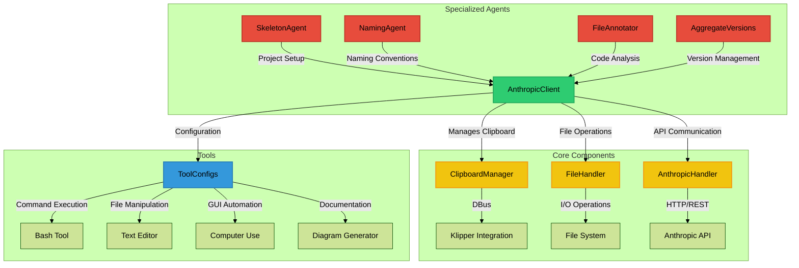
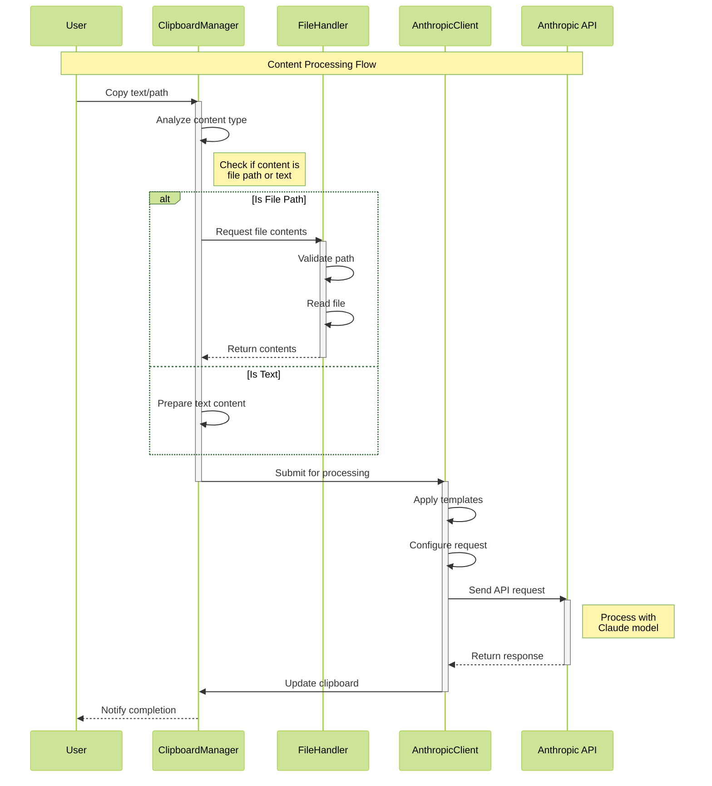
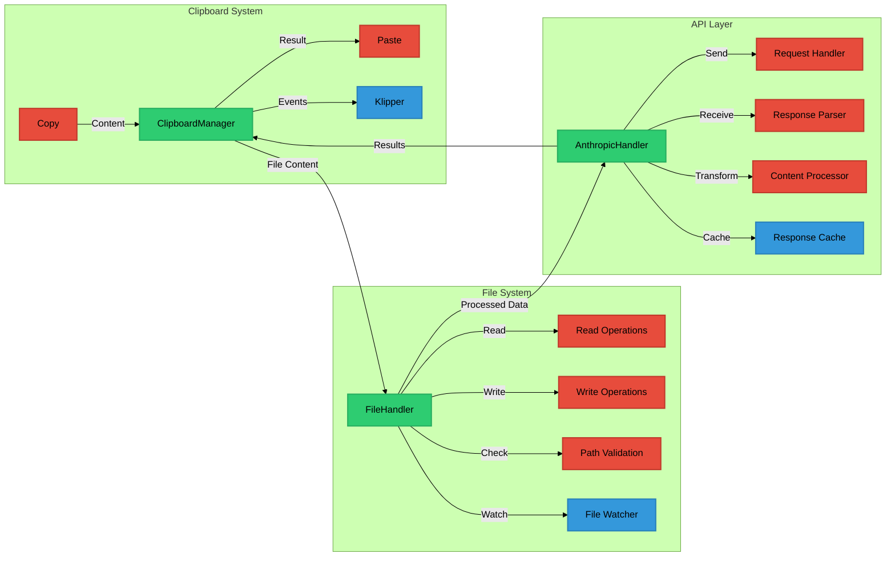
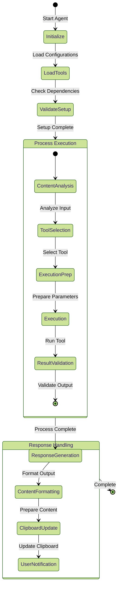
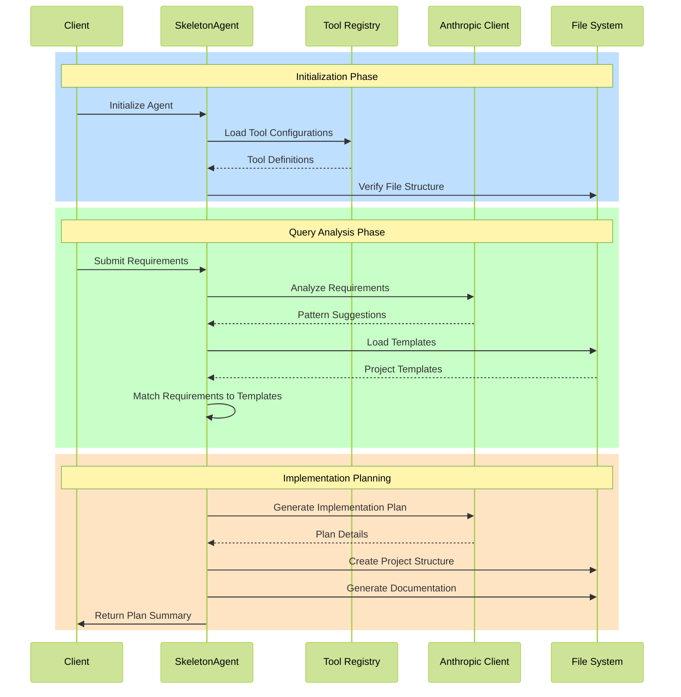
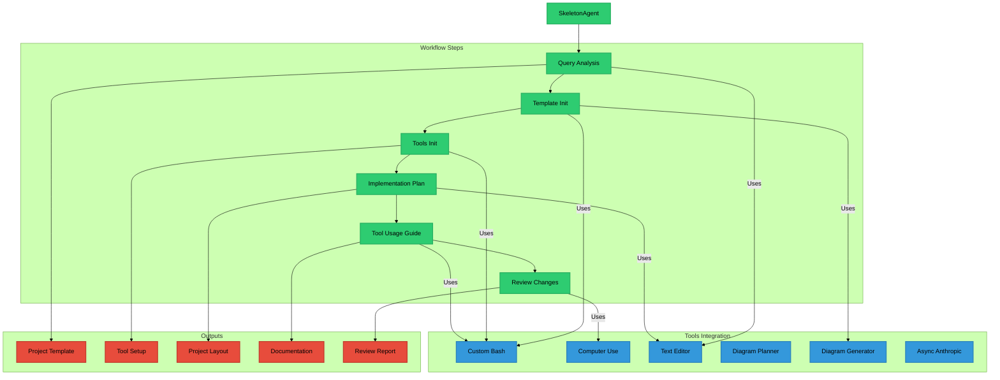

# AnthropicClient

A comprehensive Python client for Anthropic's Claude API with integrated tools for development workflow automation.

## System Architecture



## Data Flow Process



## Tool Integration Architecture



## Agent State Management



## Core Components

### AnthropicClient (`anthropic-client.py`)
- Main client interface for Anthropic API interactions
- Handles message creation, tool usage, and template management
- Supports system prompts, examples, and tool configurations
- Provides async API for all operations

### ClipboardManager
- Integrates with KDE's Klipper via DBus
- Handles clipboard content retrieval and setting
- Supports file path detection and content loading

### FileHandler
- Manages file system operations
- Handles file reading, writing, and path validation
- Supports various file formats (Python, JSON, YAML)

## Tools

### Bash Tool (`custom_bash.json`)
- Execute shell commands in a persistent environment
- Access to common Linux and Python packages
- State persistence across command calls

### Text Editor (`custom_text_editor.json`)
- View, create, and edit files
- Support for line-based operations
- File content manipulation with undo capability

### Computer Use (`custom_computer_use.json`)
- GUI automation capabilities
- Keyboard and mouse control
- Screenshot functionality

### Diagram Generator (`generate_diagram_tool.json`, `mermaid_generator.json`)
- Generate Mermaid diagrams for documentation
- Support for various diagram types and styles
- Automatic layout optimization

## Specialized Agents

### SkeletonAgent (`SkeletonAgent.json`)
- Pre-development planning and setup
- Project template selection
- Implementation plan generation
- Tool initialization and configuration

### NamingAgent (`NamingAgent.py`)
- Intelligent naming suggestions
- Context-aware naming patterns
- Consistency enforcement

### FileAnnotator (`FileAnnotator.py`)
- Code analysis and annotation
- Documentation generation
- Context-aware commenting

### AggregateVersions (`AggregateVersions.py`)
- Version comparison and merging
- Change tracking
- Conflict resolution

## Usage Examples

### Basic Message Creation
```python
from anthropic_client import AnthropicClient, MessageConfig

config = MessageConfig(
    model="claude-3-5-sonnet-20241022",
    max_tokens=8192,
    temperature=0
)

client = AnthropicClient(default_config=config)

# Create a simple message
message = await client.create_message(
    content="Hello, how can I help you?"
)
```

### Tool Usage
```python
# Use the bash tool
result = await client.create_tool_message(
    tool_name="custom_bash",
    tool_input={
        "command": "ls -la"
    }
)

# Use the text editor
result = await client.create_tool_message(
    tool_name="custom_text_editor",
    tool_input={
        "command": "view",
        "path": "/path/to/file.py"
    }
)
```

### Clipboard Integration
```python
# Process clipboard content
content = await client.clipboard_manager.get_clipboard_content()
if client.clipboard_manager.is_file_path(content):
    content = await client.file_handler.read_file_content(content)
    
response = await client.create_message(content=content)
await client.clipboard_manager.set_clipboard_content(response.content)
```

## Installation

1. Clone the repository:
```bash
git clone https://github.com/yourusername/AnthropicClient.git
```

2. Install dependencies:
```bash
pip install -r requirements.txt
```

3. Set up environment variables:
```bash
export ANTHROPIC_API_KEY="your-api-key"
```

## Configuration

The client can be configured through:
- Environment variables
- YAML configuration files
- Runtime configuration objects

Example configuration:
```yaml
api:
  model: claude-3-5-sonnet-20241022
  max_tokens: 8192
  temperature: 0

templates_dir: templates/
tools_dir: tools/

logging:
  level: INFO
  format: '%(asctime)s - %(name)s - %(levelname)s - %(message)s'
```

## Contributing

1. Fork the repository
2. Create a feature branch
3. Commit your changes
4. Push to the branch
5. Create a Pull Request

## License

MIT License - see LICENSE file for details

## SkeletonAgent Analysis

The SkeletonAgent is a sophisticated pre-development planning assistant that orchestrates project initialization and setup. Here's a detailed analysis:

### API Integration Flow



### Tool Orchestration Architecture



### API Usage Examples

1. **Initialize SkeletonAgent**:
```python
response = client.messages.create(
    model="claude-3-5-sonnet-20241022",
    system=SkeletonAgent.system_prompt,
    messages=[{
        "role": "user",
        "content": "Initialize project setup for a new microservice"
    }]
)
```

2. **Query Analysis**:
```python
response = client.messages.create(
    model="claude-3-5-sonnet-20241022",
    messages=[{
        "role": "user",
        "content": {
            "type": "tool_use",
            "step": "Query Analysis",
            "input": project_requirements,
            "templates": available_templates
        }
    }]
)
```

3. **Implementation Planning**:
```python
response = client.messages.create(
    model="claude-3-5-sonnet-20241022",
    messages=[{
        "role": "user",
        "content": {
            "type": "tool_use",
            "step": "Implementation Plan Generation",
            "pattern": selected_pattern,
            "template": project_template,
            "tools": available_tools
        }
    }]
)
```

### Key Features

1. **Workflow Orchestration**
- Sequential step execution
- Tool coordination
- State management
- Output validation

2. **Tool Integration**
- Custom bash execution
- GUI automation
- File operations
- Diagram generation
- Async API calls

3. **Documentation Generation**
- Project structure
- Implementation plans
- Tool usage guides
- Review reports

4. **Template Management**
- Pattern matching
- Template initialization
- Custom template creation
- Template validation

## Documentation

For detailed development documentation, including component analysis, workflow diagrams, and best practices, see [DEVELOPMENT.md](docs/DEVELOPMENT.md).


