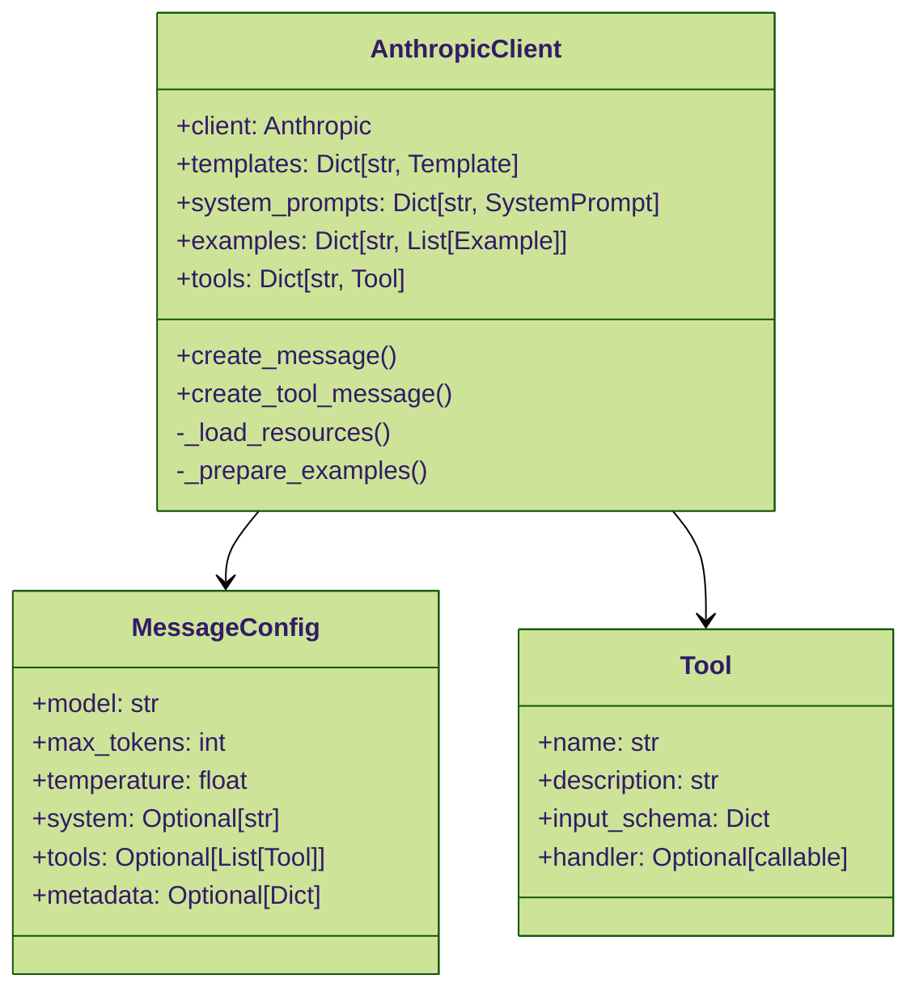
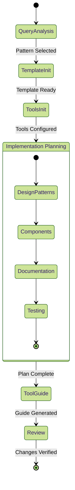
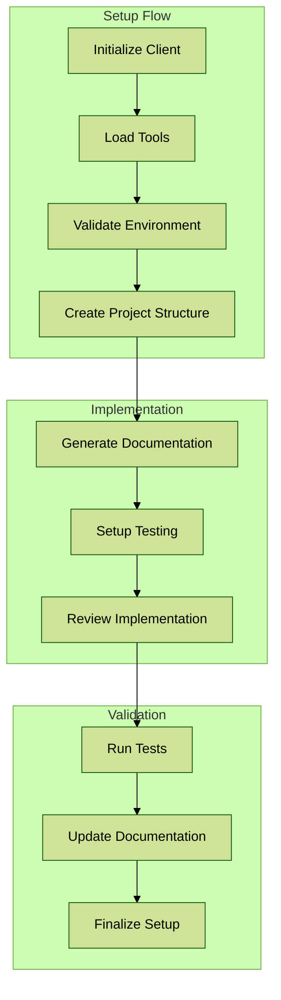

# AnthropicClient Development Documentation

## Core Components Analysis

### AnthropicClient (`anthropic-client.py`)



#### Key Features
1. **Resource Management**
   - Template loading and rendering
   - System prompt management
   - Example management for few-shot learning
   - Tool configuration and handling

2. **Message Creation**
   - Support for templated messages
   - Example injection
   - Tool usage integration
   - Error handling and logging

3. **Configuration**
   - Flexible message configuration
   - Environment-based setup
   - Template directory structure

### Project Setup Components

#### SkeletonAgent (`SkeletonAgent.json`)



#### Workflow Steps
1. **Query Analysis**
   - Pattern matching
   - Template selection
   - Requirement analysis

2. **Template Initialization**
   - Pattern loading
   - Documentation setup
   - Diagram generation

3. **Tools Initialization**
   - Tool configuration loading
   - Variable initialization
   - Configuration validation

4. **Implementation Planning**
   - Design pattern selection
   - Component hierarchy
   - Documentation structure
   - Testing strategy

### Project Development Tools

#### Project Setup (`project_devsetup.py`)



#### Project Implementation (`implement_project.py`)

Key responsibilities:
- Project structure creation
- Component implementation
- Documentation generation
- Test setup and execution

## Tool Integration

### Available Tools

1. **Custom Bash Tool**
   - Command execution
   - Environment management
   - State persistence

2. **Text Editor Tool**
   - File operations
   - Content manipulation
   - Version tracking

3. **Computer Use Tool**
   - GUI automation
   - Screenshot capture
   - Input simulation

4. **Diagram Generator**
   - Architecture visualization
   - Component relationship mapping
   - Documentation integration

## Development Workflow

1. **Project Initialization**
```python
client = AnthropicClient(
    templates_dir="templates",
    default_config=MessageConfig(
        model="claude-3-5-sonnet-20241022",
        max_tokens=8192,
        temperature=0
    )
)
```

2. **Tool Configuration**
```python
tool_config = {
    "name": "custom_tool",
    "description": "Tool description",
    "input_schema": {
        "type": "object",
        "properties": {
            "param": {"type": "string"}
        }
    }
}
```

3. **Message Creation**
```python
response = await client.create_message(
    content="Message content",
    template_name="template",
    template_variables={"var": "value"},
    example_tags=["tag"]
)
```

## Best Practices

1. **Error Handling**
   - Use try-except blocks for API calls
   - Validate inputs before processing
   - Log errors with context

2. **Configuration Management**
   - Use environment variables for sensitive data
   - Keep configurations in separate files
   - Version control configurations

3. **Documentation**
   - Document all public methods
   - Include usage examples
   - Keep diagrams updated

4. **Testing**
   - Write unit tests for core functionality
   - Include integration tests
   - Test error cases 