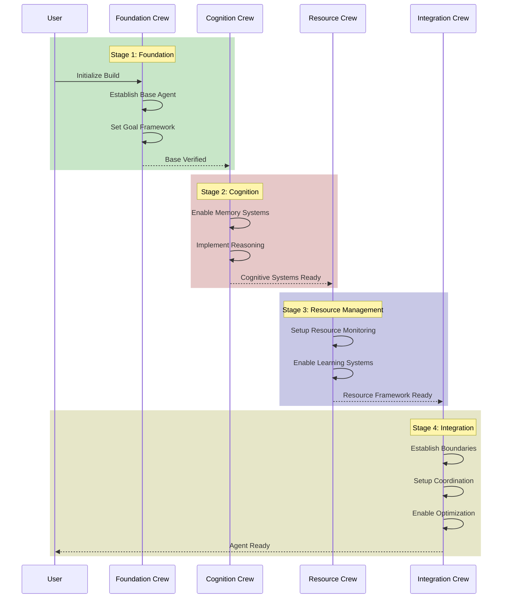

## Diagram from a s tructured input

### For example, given the following input:
```yaml
# Stage 1: Foundation Crew
foundation_crew:
  description: "Establishes core agent functionality and goal framework"
  advancement_criteria:
    - "Base agent successfully executes independent tasks"
    - "Goal framework verified and operational"
    - "Decision-making system functional"
  agents:
    base_architect:
      role: "Core Agent Architecture Designer"
      goal: "Design and implement foundational agent capabilities"
      backstory: "Expert in autonomous systems design with focus on independence"
      tools:
        - SpiderTool
        - "anthropic.tools.base"
    goal_engineer:
      role: "Goal System Designer"
      goal: "Implement goal-setting and tracking framework"
      backstory: "Specialist in objective-oriented system design"
      tools:
        - "anthropic.tools.goal_tracking"
  tasks:
    establish_base:
      description: "Create core agent framework with autonomous execution capability"
      expected_output: "Functional base agent with verified independence"
      agent: base_architect
    implement_goals:
      description: "Design and implement goal management system"
      expected_output: "Operational goal framework with priority management"
      agent: goal_engineer

# Stage 2: Cognition Crew
cognition_crew:
  description: "Implements memory and reasoning systems"
  advancement_criteria:
    - "Memory systems operational and verified"
    - "Reasoning framework demonstrates chain-of-thought capabilities"
    - "Self-correction mechanisms functional"
  agents:
    memory_architect:
      role: "Memory Systems Designer"
      goal: "Implement episodic and working memory systems"
      backstory: "Expert in cognitive architecture design"
      tools:
        - "anthropic.tools.memory_management"
    reasoning_engineer:
      role: "Reasoning Systems Designer"
      goal: "Implement logical reasoning and hypothesis testing"
      backstory: "Specialist in AI reasoning systems"
      tools:
        - "anthropic.tools.reasoning"
  tasks:
    implement_memory:
      description: "Design and implement memory management systems"
      expected_output: "Functional memory system with context retention"
      agent: memory_architect
    establish_reasoning:
      description: "Implement reasoning and self-correction frameworks"
      expected_output: "Operational reasoning system with verification"
      agent: reasoning_engineer

# Stage 3: Resource Crew
resource_crew:
  description: "Handles resource management and learning systems"
  advancement_criteria:
    - "Resource monitoring system operational"
    - "Learning framework demonstrates adaptation"
    - "Performance optimization verified"
  agents:
    resource_manager:
      role: "Resource Optimization Specialist"
      goal: "Implement resource monitoring and optimization"
      backstory: "Expert in system resource management"
      tools:
        - "anthropic.tools.resource_monitoring"
    learning_engineer:
      role: "Learning Systems Designer"
      goal: "Implement adaptive learning capabilities"
      backstory: "Specialist in machine learning systems"
      tools:
        - "anthropic.tools.learning"
  tasks:
    setup_monitoring:
      description: "Implement resource monitoring and optimization"
      expected_output: "Functional resource management system"
      agent: resource_manager
    implement_learning:
      description: "Design and implement learning framework"
      expected_output: "Operational learning system with adaptation"
      agent: learning_engineer

# Stage 4: Integration Crew
integration_crew:
  description: "Handles final integration and optimization"
  advancement_criteria:
    - "Boundary systems operational"
    - "Coordination framework verified"
    - "Optimization systems functional"
  agents:
    integration_architect:
      role: "System Integration Specialist"
      goal: "Coordinate final system integration"
      backstory: "Expert in complex system integration"
      tools:
        - "anthropic.tools.integration"
    optimization_engineer:
      role: "System Optimization Specialist"
      goal: "Implement final optimization systems"
      backstory: "Specialist in system optimization"
      tools:
        - "anthropic.tools.optimization"
  tasks:
    establish_boundaries:
      description: "Implement system boundaries and constraints"
      expected_output: "Verified boundary framework"
      agent: integration_architect
    setup_coordination:
      description: "Implement coordination and handoff systems"
      expected_output: "Operational coordination framework"
      agent: integration_architect
    enable_optimization:
      description: "Implement self-optimization capabilities"
      expected_output: "Functional optimization system"
      agent: optimization_engineer
```

### Return single mermaid diagram source like the following:

