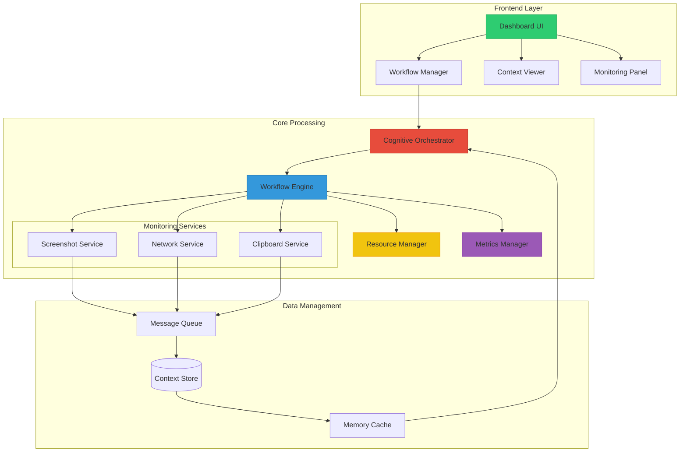
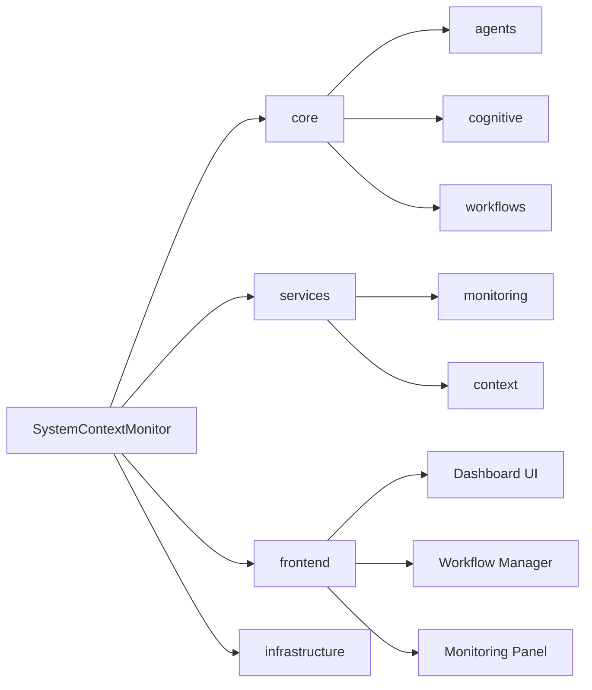
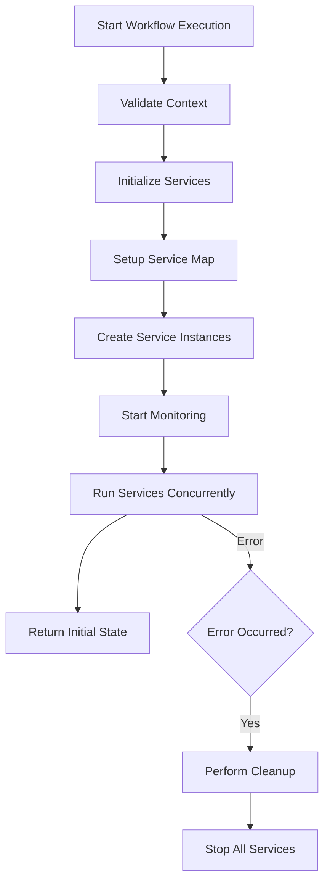
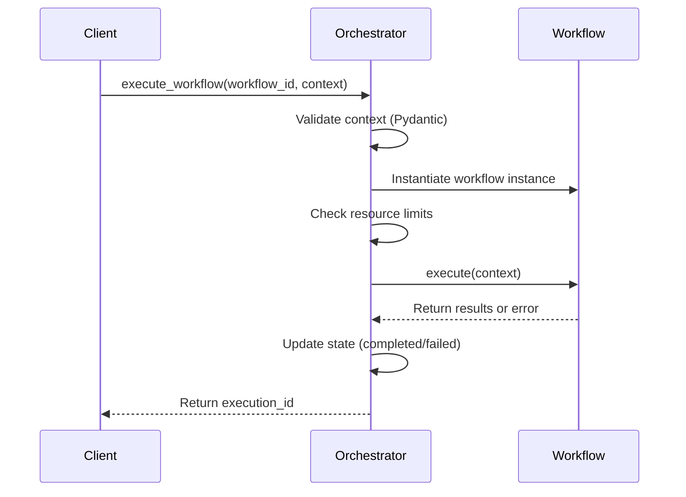
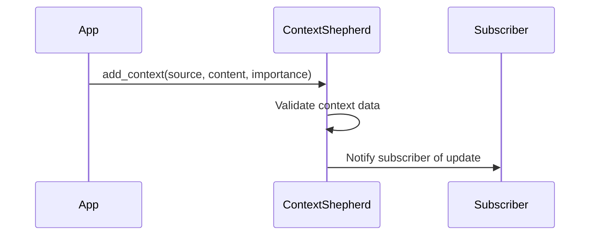
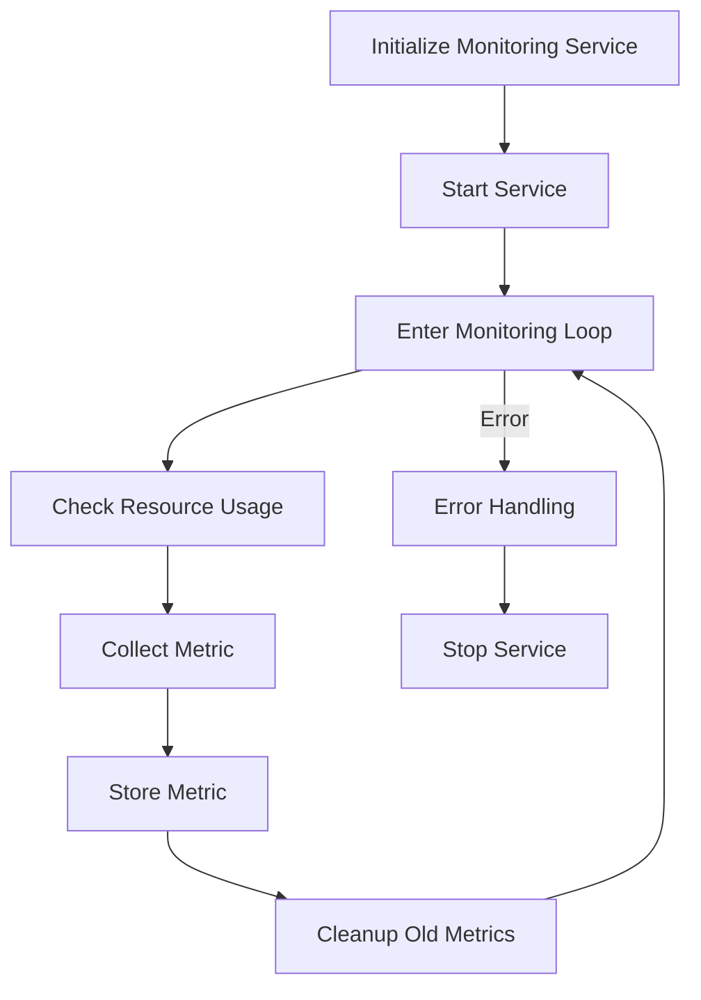
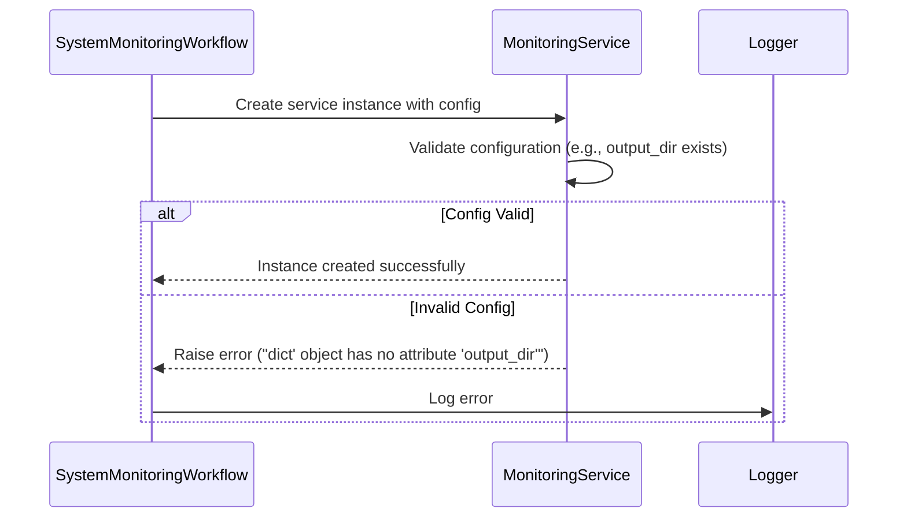
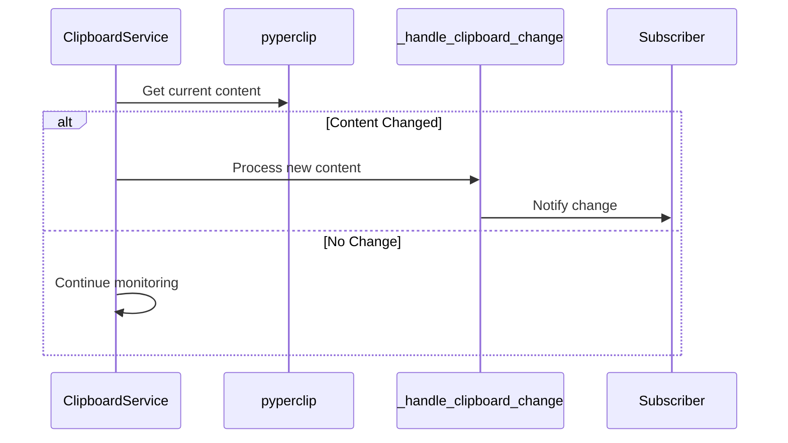
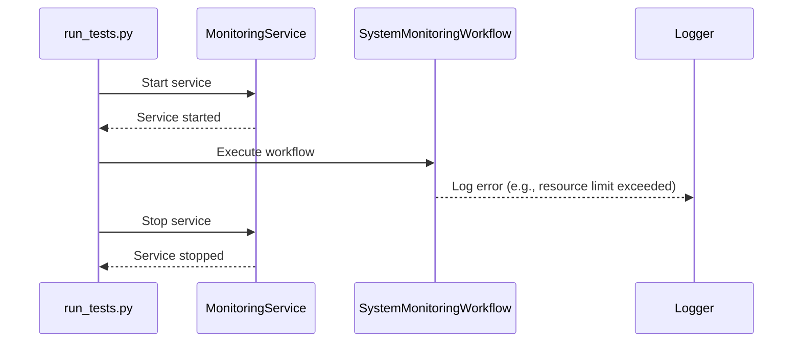

# System Context Monitor

A comprehensive system monitoring solution that combines real-time monitoring data with advanced cognitive workflows. This project integrates monitoring capabilities with context-aware processing, providing a modern and intelligent approach to system observation and analysis.

## Features

- **Real-time Monitoring**
  - Screenshot capture and analysis
  - Clipboard monitoring
  - Network activity tracking
  - System metrics collection

- **Cognitive Processing**
  - Context-aware workflow orchestration
  - Intelligent data aggregation
  - Pattern recognition and analysis
  - Adaptive monitoring based on context

- **Modern UI**
  - Real-time dashboard updates
  - Interactive workflow management
  - Context visualization
  - QR code-based context sharing

- **Security & Resource Management**
  - Secure data handling
  - Resource usage monitoring
  - Rate limiting and throttling
  - Access control and validation

## System Architecture



## Architecture

The system is built with a modular architecture following agentic design patterns:

```
SystemContextMonitor/
├── core/                    # Core system components
│   ├── agents/             # Agent composers and state managers
│   ├── cognitive/          # Cognitive processing tools
│   └── workflows/          # Predefined workflows
├── services/               # Service implementations
│   ├── monitoring/         # Monitoring services
│   └── context/           # Context management
├── frontend/              # React-based UI
└── infrastructure/        # Deployment configs
```

## Prerequisites

- Python 3.9+
- Node.js 16+
- Poetry (Python dependency management)
- npm or yarn (Node.js package management)

## Installation

1. **Clone the repository**
   ```bash
   git clone https://github.com/yourusername/system-context-monitor.git
   cd system-context-monitor
   ```

2. **Install Python dependencies**
   ```bash
   poetry install
   ```

3. **Install frontend dependencies**
   ```bash
   cd frontend
   npm install
   ```

4. **Set up environment variables**
   ```bash
   cp .env.example .env
   # Edit .env with your configuration
   ```

## Development Setup

1. **Start the backend server**
   ```bash
   poetry shell
   python -m services.context.api
   ```

2. **Start the frontend development server**
   ```bash
   cd frontend
   npm run dev
   ```

3. **Access the application**
   - Backend API: http://localhost:8000
   - Frontend: http://localhost:5173
   - API Documentation: http://localhost:8000/docs

## Usage

### Starting Monitoring

1. Launch the application
2. Navigate to the dashboard
3. Configure monitoring settings:
   - Screenshot interval
   - Network capture rules
   - Clipboard monitoring preferences

### Managing Workflows

1. Access the Workflow Manager
2. Create new workflows or select existing ones
3. Monitor workflow execution in real-time
4. View detailed results and analytics

### Accessing Context

1. Use the Context Viewer to explore current system state
2. Scan QR codes to share context across devices
3. Export context data for external analysis

## API Documentation

The system provides a comprehensive REST API and WebSocket interface:

### REST Endpoints

- `GET /api/context` - Retrieve current system context
- `POST /api/context` - Update system context
- `POST /api/workflows` - Execute cognitive workflow
- `GET /api/workflows/{id}` - Get workflow state

### WebSocket Events

- `context_update` - Real-time context updates
- `workflow_state` - Workflow execution updates
- `monitoring_data` - Live monitoring data

## Security Considerations

1. **Data Protection**
   - All sensitive data is encrypted
   - Secure WebSocket connections
   - Rate limiting on API endpoints

2. **Access Control**
   - Role-based access control
   - API key authentication
   - Session management

3. **Resource Management**
   - Monitoring rate limits
   - Storage quotas
   - CPU/Memory restrictions

## Contributing

1. Fork the repository
2. Create a feature branch
3. Commit your changes
4. Push to the branch
5. Create a Pull Request

## Testing

Run the test suites:

```bash
# Backend tests
poetry run pytest

# Frontend tests
cd frontend
npm test
```

## License

This project is licensed under the MIT License - see the LICENSE file for details.

## Acknowledgments

- Built with FastAPI and React
- Uses Material-UI for frontend components
- Implements agentic design patterns
- Security standards based on OWASP guidelines


Below is the new `diagrams.md` file containing the requested Mermaid diagrams. All diagrams have been created following the Mermaid Diagram Generator standards (mermaid-generator.mdc), including proper syntax validation, incremental building, and style management.

---

# Diagrams for the System Context Monitor

This file includes multiple Mermaid diagrams documenting the architecture, workflows, and processes of our System Context Monitor codebase.

---

## 1. High-Level Code Structure Diagram

This diagram visualizes the overall directory structure and main modules in the project.



---

## 2. System Monitoring Workflow Flow Diagram

This flowchart illustrates the process within the SystemMonitoringWorkflow—from context validation to service initialization, concurrent monitoring, and error handling.



---

## 3. Cognitive Orchestrator Workflow Execution Sequence Diagram

This sequence diagram details how the CognitiveOrchestrator executes a workflow, including context validation, resource checks, execution, and state updates.



---

## 4. Context Management Flow Diagram

This diagram highlights the process of adding context data and notifying subscribers via the ContextShepherd module.



---

## 5. Monitoring Service Lifecycle Diagram

This flowchart outlines the lifecycle of a monitoring service—from initialization and metric collection to error handling and cleanup.



---

## 6. Service Initialization Error Handling Diagram

This sequence diagram visualizes the error handling flow during service initialization, especially when configuration data is invalid.



---

## 7. Clipboard Service Monitoring Flow Diagram

This diagram shows the flow of clipboard monitoring—from periodic checking to detecting content changes and notifying subscribers.



---

## 8. Test Execution Flow Diagram

This diagram illustrates the overall test execution flow, highlighting service startup, workflow execution, error logging, and cleanup sequences.


