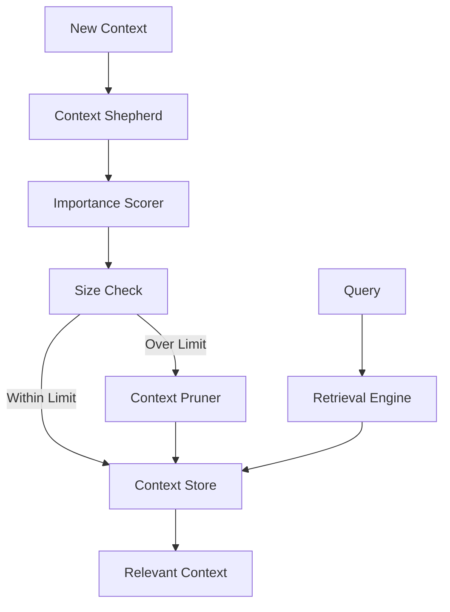
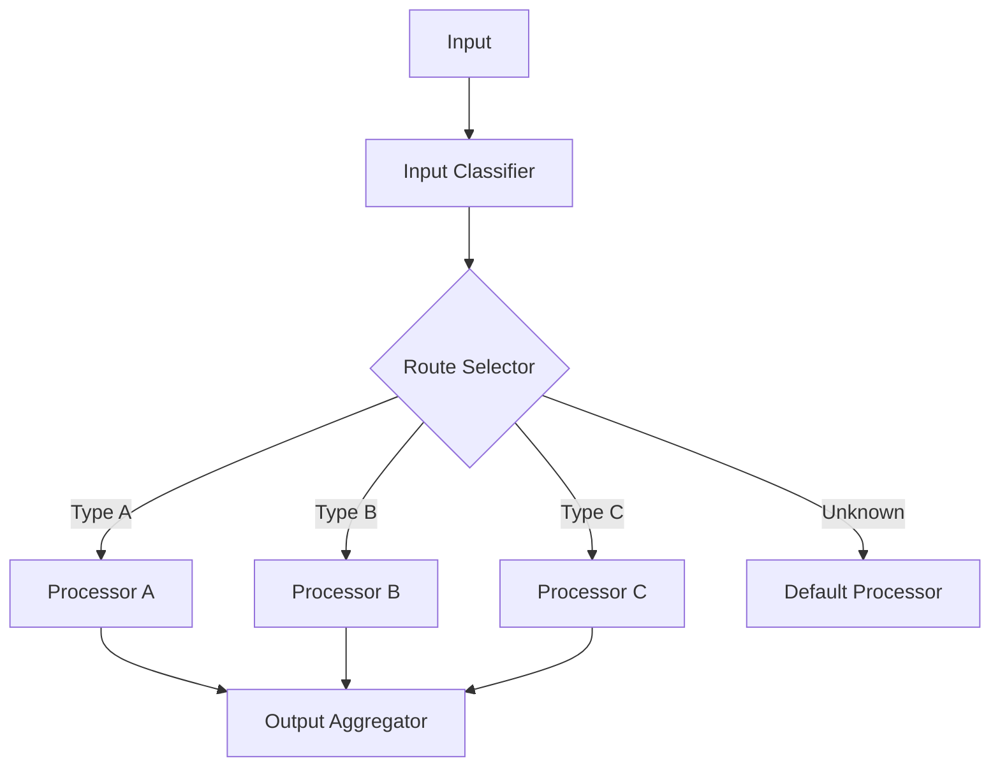
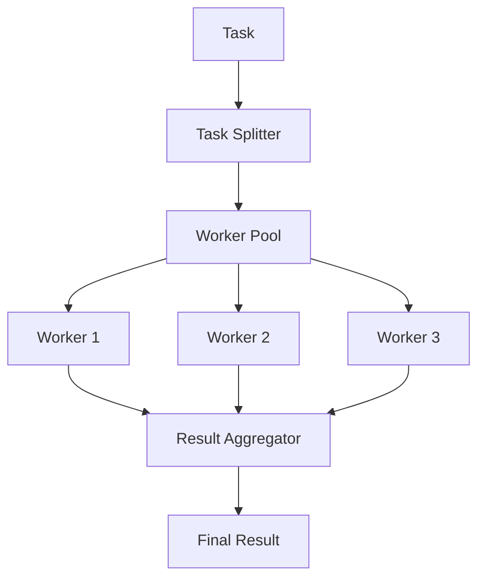
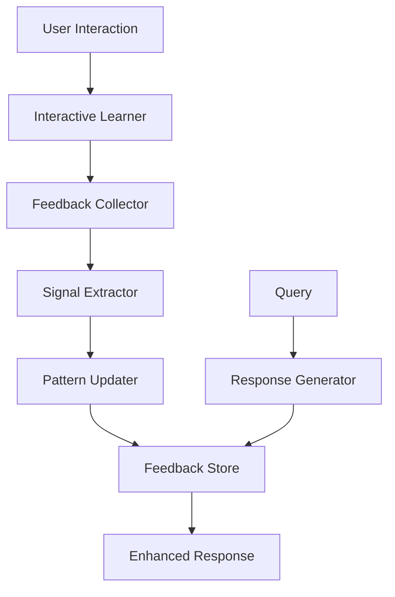
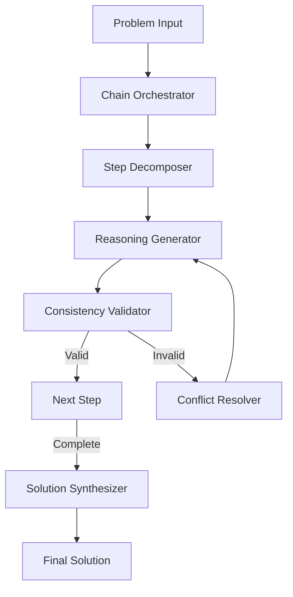

# MCP System Context Server Documentation

## Overview

The MCP System Context Server provides a standardized way for LLMs to access system context, including:
- File system access
- Shell history
- Clipboard content
- System monitoring
- Vector search capabilities

## Installation

```bash
pip install mcp-system-context
```

## Configuration

The server can be configured through:
1. Environment variables
2. Configuration file
3. Command-line arguments

### Environment Variables

```env
# Server Configuration
MCP_ALLOWED_USERS=user1,user2
MCP_PATH_PATTERNS=/home/user/projects/*,/tmp/*
MCP_REMOTE_ENABLED=true
MCP_LOG_LEVEL=INFO

# Clipboard Configuration
MCP_CLIPBOARD__MAX_HISTORY=100
MCP_CLIPBOARD__MONITOR_INTERVAL=1.0
MCP_CLIPBOARD__SAVE_ON_CHANGE=true

# System Monitor Configuration
MCP_SYSTEM_MONITOR__MAX_COMMAND_HISTORY=1000
MCP_SYSTEM_MONITOR__DEFAULT_LOG_LINES=100
MCP_SYSTEM_MONITOR__COMMAND_TIMEOUT=5.0

# Vector DB Configuration
MCP_VECTOR_DB__COLLECTION_NAME=files
MCP_VECTOR_DB__EMBEDDING_MODEL=all-MiniLM-L6-v2
```

### Configuration File

```json
{
  "allowed_paths": ["/home/user/projects", "/tmp"],
  "allowed_users": ["user1", "user2"],
  "path_patterns": ["/home/user/projects/*", "/tmp/*"],
  "remote_enabled": true,
  "log_level": "INFO",
  "clipboard": {
    "max_history": 100,
    "monitor_interval": 1.0,
    "save_on_change": true
  },
  "system_monitor": {
    "max_command_history": 1000,
    "default_log_lines": 100,
    "command_timeout": 5.0
  },
  "vector_db": {
    "collection_name": "files",
    "embedding_model": "all-MiniLM-L6-v2"
  }
}
```

### Command-line Arguments

```bash
mcp-system-context --config config.json --env-file .env
```

## Available Resources

### File System

- `file://{path}` - Access file or directory content
```python
# Example
content = await mcp.get_resource("file:///home/user/projects/example.txt")
```

### Shell History

- `shell://history` - Access shell command history
```python
history = await mcp.get_resource("shell://history")
```

### Clipboard

- `clipboard://current` - Get current clipboard content
- `clipboard://history` - Get clipboard history
```python
content = await mcp.get_resource("clipboard://current")
history = await mcp.get_resource("clipboard://history")
```

### System Monitoring

- `system://logs/{unit}` - Access systemd logs
- `system://network/connections` - Get network connections
- `system://network/routes` - Get network routes
```python
logs = await mcp.get_resource("system://logs/ssh")
connections = await mcp.get_resource("system://network/connections")
```

### Vector Database

- `context://vector-db/collections/{collection_name}` - Access vector collections
```python
collection = await mcp.get_resource("context://vector-db/collections/files")
```

## Available Tools

### File Operations

```python
# List directory
entries = await mcp.call_tool("list_directory", path="/home/user/projects")

# Read file
content = await mcp.call_tool("read_file", path="/home/user/example.txt")
```

### Search Operations

```python
# Search shell history
matches = await mcp.call_tool("search_history", pattern="git commit")

# Search clipboard history
matches = await mcp.call_tool("search_clipboard", query="example")

# Semantic search
results = await mcp.call_tool("search_files", query="python example", max_results=5)
```

### System Operations

```python
# Get system information
info = await mcp.call_tool("get_system_info")

# Get process list
processes = await mcp.call_tool("get_process_list")
```

### Clipboard Operations

```python
# Copy to clipboard
await mcp.call_tool("copy_to_clipboard", content="Example text")
```

## Security Considerations

1. Path Validation
   - All file access is restricted to allowed paths
   - Path traversal protection is implemented
   - Glob patterns can be used for flexible access control

2. User Authorization
   - Only allowed users can access the server
   - Command execution is restricted to safe commands
   - All operations are logged

3. Resource Limits
   - File size limits for reading
   - History size limits
   - Command execution timeouts

## Development

### Running Tests

```bash
# Install development dependencies
pip install -e ".[dev]"

# Run tests
pytest

# Run tests with coverage
pytest --cov=mcp_system_context
```

### Adding New Features

1. Update configuration in `config.py`
2. Implement feature in appropriate module
3. Add tests in `tests/` directory
4. Update documentation

## Examples

See the `examples/` directory for:
- Basic usage example
- LLM integration example
- Configuration examples

## Troubleshooting

### Common Issues

1. Permission Denied
   - Check user is in allowed_users
   - Verify path is in allowed_paths
   - Check file permissions

2. Clipboard Issues
   - Ensure X11 forwarding is enabled
   - Check pyperclip dependencies

3. Vector DB Issues
   - Verify persistence directory permissions
   - Check embedding model availability

### Logging

Set `MCP_LOG_LEVEL=DEBUG` for detailed logging output.

## Contributing

See [CONTRIBUTING.md](../CONTRIBUTING.md) for guidelines.

## Further Development Ideas

As the MCP System Context Server evolves, there are several avenues for further development to enhance its capabilities, scalability, and integration with advanced LLM functionalities. Below are some proposals and architectural ideas inspired by best practices and design rules from various patterns:

### 1. Building Effective Agents

- **Modularity & Transparency**: Continuously refine agent modules to ensure that context management, tool integrations, and decision-making processes are clear and transparent. 
- **Iterative Feedback Loops**: Implement logging and self-assessment mechanisms so that agents can learn from past interactions and optimize their response quality over time.
- **Future Integration**: Leverage emerging LLM enhancements for more robust reasoning and dynamic updates.

### 2. Context Shepherd Enhancements

Improve the system's ability to manage large and evolving context using strategies such as importance scoring and pruning. This pattern ensures that the most relevant context is available to LLMs without overwhelming them.



### 3. Routing Workflow Improvements

Enhance routing capabilities to classify and direct various inputs to specialized processors. This includes fallback strategies and load balancing among different tools.



### 4. Parallelization Workflow Enhancements

Develop a more robust parallel processing engine to handle simultaneous tasks efficiently, aggregate results, and manage resources effectively.



### 5. Interactive Learning Integration

Integrate mechanisms for collecting real-time user feedback to dynamically update system patterns. This can drive improvements in both response quality and error handling.



### 6. Chain-of-Thought Orchestrator Enhancements

Strengthen the reasoning capabilities by managing multi-step logical flows and ensuring consistency. This will improve the final solution synthesis and enable more complex problem solving.



### 7. Broader MCP Integration and Architecture Considerations

- **Enhanced Security & Authorization**: Integrate multi-factor authentication and fine-grained access control mechanisms, as discussed in [MCP Architecture](https://modelcontextprotocol.io/docs/concepts/architecture) and MCP llms documentation.
- **Remote Deployment & Scalability**: Explore cloud deployments, containerization strategies, and the use of distributed architectures to support remote MCP servers as per the latest MCP servers guidelines.
- **Advanced Logging & Monitoring**: Incorporate detailed logging, performance benchmarks, and error tracking to help developers monitor system health and quickly diagnose issues.
- **User Interface & Control Panels**: Develop admin dashboards that visualize system status using mermaid diagrams and real-time metrics, drawing inspiration from modern MCP server implementations like FastMCP (see [FastMCP GitHub](https://github.com/jlowin/fastmcp)).

These further development ideas are aligned with industry best practices and the provided guidelines from:
- [Building Effective Agents](https://modelcontextprotocol.io/docs/concepts/architecture) (see also GitHub examples from fastMCP)
- [Context Shepherd Pattern Rules](#)
- [Routing Workflow Pattern Rules](#)
- [Parallelization Workflow Pattern Rules](#)
- [Interactive Learning Pattern Rules](#)
- [Chain-of-Thought Orchestrator Pattern Rules](#)

By incorporating these ideas, the MCP System Context Server can continue evolving into a more robust, secure, and feature-rich platform capable of supporting complex LLM integrations and advanced system monitoring tasks. 